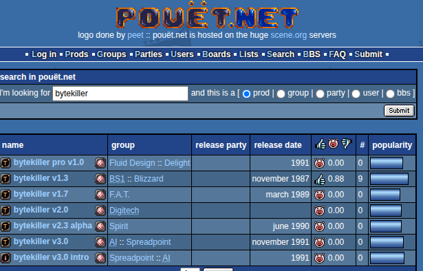

# Stage-Swaptro
Disassembly / analysis of Swaptro by Stage (Velveteen 18 by Sanity)

## Preamble
This repository holds all the files used to analyse and reverse engineer an Amiga "swaptro" from the '90s called "Stage-Swaptro".
It is just a small executable with a single screen and a single effect with some text on it, meant to find people willing to swap software with the authors, who were part of a group called "Stage", based mainly in Istanbul (Turkey).

According to demozoo.org, the team was:
- Kris (Rebels) - Code
- Gin (real name: Mikael Hultén) - Music
- Orion (also known as VIC) - Text

You can watch it here: https://www.youtube.com/watch?v=uhVpMpvvlGM

I found the swaptro inside "Velveteen 18", a disk demopack released in the early '90s by the well known group "Sanity".

I decided to try disassembling and reassembling it because:
- I like the swaptro; it captures the essence of Amiga users in the '90s.
- It is very simple from a technical standpoint.
- The code is not obfuscated.
- It is small in size.
- I wanted to patch it and recompile it into an AmigaOS friendly executable that ideally runs on every Amiga setup with any Kickstart.
- I wanted to make some changes with my own graphical assets and custom text, to produce something similar with the same vibes.

## Getting started
So how do you start disassembling and reassembling something?
Well, I do not really know: this is my first attempt and I had no idea where to begin, but I am quite sure there are plenty of different ways to do it.
In this section I describe how I did it, mostly for my own reference. This document is not intended as a tutorial or as an explanation of how things should be done.

Everything started, of course, by getting the disk image from pouet. The ADF is also included in this repository as "Sanity-Velveteen18.adf". The demopack is distributed in DMS format; I simply converted it to ADF, since that format is supported by every Amiga tool out there.

In the root of the floppy there is the file `06`; double clicking on it triggers a short decompression and loading phase.

## Compression
Disassembling the `06` executable produces some code followed by a long list of `dc.l` statements (raw data), which suggests that a compression algorithm was used.
To find out which one, and to decompress the data, we need to isolate the raw data and feed it to an analysis program.

To view the disassembled code I used Aira Force (https://howprice.itch.io/aira-force), a wrapper around the well known IRA disassembler (https://aminet.net/package/dev/asm/ira).

You can inspect the disassembled code at https://github.com/Ozzyboshi/Stage-Swaptro/blob/main/06.asm
The compressed data starts at line 112 and continues to the end of the file.

To keep only the compressed data, delete all the code up to line 112 and then assemble the file with vasm:

```
$/mnt/ramdisk$ vasmm68k_mot -Fbin ./06.asm -o rawcompresseddata
vasm 2.0e (c) in 2002-2026 Volker Barthelmann
vasm M68k/CPU32/ColdFire cpu backend 2.8 (c) 2002-2025 Frank Wille
vasm motorola syntax module 3.19d (c) 2002-2025 Frank Wille
vasm binary output module 2.3e (c) 2002-2025 Volker Barthelmann and Frank Wille
org0001:0(acrwx1):       66212 bytes
$/mnt/ramdisk$ ancient i rawcompresseddata
Compression of rawcompresseddata is BK: ByteKiller
```

Good: thanks to ancient (https://github.com/temisu/ancient) we now know that ByteKiller was used as the compression algorithm.

There are a few ByteKiller decompression programs on pouet, so let's see whether they can decompress the data.

