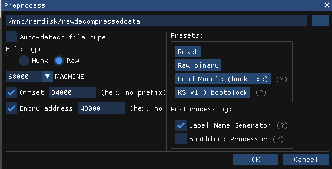
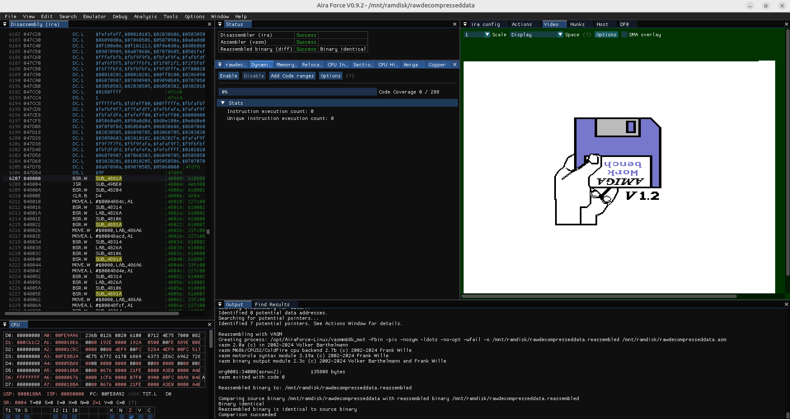

# Stage-Swaptro
Disassembly / analysis of Swaptro by Stage (Velveteen 18 by Sanity)

## Preamble
This repository holds all the files used to analyse and reverse engineer an Amiga "swaptro" from the '90s called "Stage-Swaptro".
It is just a small executable with a single screen and a single effect with some text on it, meant to find people willing to swap software with the authors, who were part of a group called "Stage", based mainly in Istanbul (Turkey).

According to demozoo.org, the team was:
- Kris (Rebels) - Code
- Gin (real name: Mikael Hultén) - Music
- Orion (also known as VIC) - Text

You can watch it here: https://www.youtube.com/watch?v=uhVpMpvvlGM

I found the swaptro inside "Velveteen 18", a disk demopack released in the early '90s by the well known group "Sanity".

I decided to try disassembling and reassembling it because:
- I like the swaptro; it captures the essence of Amiga users in the '90s.
- It is very simple from a technical standpoint.
- The code is not obfuscated.
- It is small in size.
- I wanted to patch it and recompile it into an AmigaOS friendly executable that ideally runs on every Amiga setup with any Kickstart.
- I wanted to make some changes with my own graphical assets and custom text, to produce something similar with the same vibes.

## Getting started
So how do you start disassembling and reassembling something?
Well, I do not really know: this is my first attempt and I had no idea where to begin, but I am quite sure there are plenty of different ways to do it.
In this section I describe how I did it, mostly for my own reference. This document is not intended as a tutorial or as an explanation of how things should be done.

Everything started, of course, by getting the disk image from pouet. The ADF is also included in this repository as "Sanity-Velveteen18.adf". The demopack is distributed in DMS format; I simply converted it to ADF, since that format is supported by every Amiga tool out there.

In the root of the floppy there is the file `06`; double clicking on it triggers a short decompression and loading phase.

## Compression
Disassembling the `06` executable produces some code followed by a long list of `dc.l` statements (raw data), which suggests that a compression algorithm was used.
To find out which one, and to decompress the data, we need to isolate the raw data and feed it to an analysis program.

To view the disassembled code I used Aira Force (https://howprice.itch.io/aira-force), a wrapper around the well known IRA disassembler (https://aminet.net/package/dev/asm/ira).

You can inspect the disassembled code at https://github.com/Ozzyboshi/Stage-Swaptro/blob/main/06.asm
The compressed data starts at line 112 and continues to the end of the file.

To keep only the compressed data, delete all the code up to line 112 and then assemble the file with vasm:

```
$/mnt/ramdisk$ vasmm68k_mot -Fbin ./06.asm -o rawcompresseddata
vasm 2.0e (c) in 2002-2026 Volker Barthelmann
vasm M68k/CPU32/ColdFire cpu backend 2.8 (c) 2002-2025 Frank Wille
vasm motorola syntax module 3.19d (c) 2002-2025 Frank Wille
vasm binary output module 2.3e (c) 2002-2025 Volker Barthelmann and Frank Wille
org0001:0(acrwx1):       66212 bytes
$/mnt/ramdisk$ ancient i rawcompresseddata
Compression of rawcompresseddata is BK: ByteKiller
```

Good: thanks to ancient (https://github.com/temisu/ancient) we now know that ByteKiller was used as the compression algorithm.

Ancient can also decompress the whole file into another with command :

```
$ ancient d rawcompresseddata rawdecompresseddata
```
I put these files into the "ancient" dir on this repository if you want to take a look.

## Let the fun begin

Now we can start the real work, we need to disassemble the uncompressed blob and see what is inside, for that we use Aira Force,
take the rawdecompresseddata file and copy it into a new empty folder, then open Aira force and start the emulator with f5, the kickstart screen should appear
in the video window.

We are ready to inject our code inside the emulator, on aira force:
- File -> new project
- Select the file rawdecompresseddata we copied before into an empty dir
- Fill the preprocess window with the following values, I will explain why later, for now just trust me



- If everything is ok you should see something like this



- Press CTRL+L, this will inject the swaptro into the emulator chipram
- In the left pane, where the code is shown, right click over line 6207 (address 48000), there should be a bsr.w SUB_4881A, and select "Set PC", the swaptro should run on the emulator.

## Offset and Entry point

Before, in the preprocess windows we used value $34000 for offset and value $40000 for Entry address.
The reason for that is that bytekiller decompresses the whole blob at a fixed memory area (value $34000) and, once extraction is completed, it forces the program counter to $4000 which is the first instruction to the Swaptro.
This is the exact moment when Bytekiller hands over the control to the Swaptro code.
If take a look at the extract routine source code (extracted with Aira Force) https://github.com/Ozzyboshi/Stage-Swaptro/blob/a71ed6397429ce65b26a7bee04b535f6c879625b/06.asm#L17 and https://github.com/Ozzyboshi/Stage-Swaptro/blob/a71ed6397429ce65b26a7bee04b535f6c879625b/06.asm#L91 this is clearly visibile.

Another way to determine the entry point is looking for code, I usually look for an rts (4e75) and go backward until I found something that smells like amiga like loading sysbase into A6.

## Absolute addresses vs relocatable addresses

Now, thanks to Aira Force (ira and vasm) we are able to disassemble and reassemble again but there are some issues that needs still to be solved.
First of all the executable is in raw binary, if we want to distribute a uncompressed executable we need to rebuild in hunk format.
Doing so the AmigaOs will read hunks of data from our executable and load them whenever there is enough space.
This concept collides with our current format, for example, take a look at this line:

https://github.com/Ozzyboshi/Stage-Swaptro/blob/2fb91880510cfa84159e977617ddd4a7afb2b255/dec/06_decompressed.asm#L34261

Here the startup routine is writing the address of the new copperlist inside GFXBASE so that graphics.library, at the next frame, can set it into copper hardware registers.
You will notice the issue immediately, the new copperlist is expected to be at $000484e4, which is always true when launching after bytekiller decompressed the blob but cannot be taken from granted if the user wants to launch it from the AmigaOS.
For this reason I had to change this line into this
https://github.com/Ozzyboshi/Stage-Swaptro/blob/2fb91880510cfa84159e977617ddd4a7afb2b255/dec/6.s#L386

Now the copperlist address is determined by AmigaOS and it's not absolute anymore, a LABEL will help us determine where this piece of information is.
As you can imagine there are tons of absolute references, mainly related to assets (music, and images in raw format) and I had to find all these places and provide some alternative way to figure out the correct addresses.

In many situations I had also to change the logic a little bit because some assumptions cannot be true anymore for example:
https://github.com/Ozzyboshi/Stage-Swaptro/blob/2fb91880510cfa84159e977617ddd4a7afb2b255/dec/6.s#L103
Here in order to scroll text towards the top of the screen a simple addi.w is used because the author took for granted that the bitplanes are world aligned.
In our AmigaOS compliant word we cannot give this for granted, if the bitplanes fall in a particular memory space we can have potential wrap ups leading to random glitches (or crashes?).
My solution in this case was to store the whole 24 bit address into a variable and then writing a copperlist pointing routine here
https://github.com/Ozzyboshi/Stage-Swaptro/blob/2fb91880510cfa84159e977617ddd4a7afb2b255/dec/6.s#L192

As you can see some manual intervention was needed, not everything is fully automated even if I am sure a good AI can help a lot or maybe do the job for you entirely.

## Memory Map

| File offset | Address | Size | Contents |
|---|---|---|---|
| `$00000` | `$34000` | 5600 | Logo 320×35, 4 bitplanes (planes at +$000/+$578/+$AF0/+$1068) |
| `$015E0` | `$355E0` | 288 | padding |
| `$01700` | `$35700` | 74882 | ProTracker module "smells like pop" (16 samples, 18 patterns, songlen 30) |
| `$13D82` | `$47D82` | 638 | zero padding |
| `$14000` | `$48000` | 1252 | **Main code** |
| `$144E4` | `$484E4` | 764 | Copperlist (terminated by `FFFF FFFE` at `$147DC`) |
| `$147E4` | `$487E4` | 17 | `"graphics.library"` |
| `$147F6` | `$487F6` | 4 | Saved GfxBase |
| `$147FA` | `$487FA` | 32 | Level 3 interrupt handler (VERTB → mt_music, then `jmp` to the old `$6C`) |
| `$1481A` | `$4881A` | 20 | `clear_screens` — clears `$70000`–`$7F000` |
| `$1482E` | `$4882E` | 30 | `wait_2_frames` (polling `$DFF006`) |
| `$1484C` | `$4884C` | 4488 | **8 text pages**, 40×16 characters + `$00` (641 bytes for a full page) |
| `$159D4` | `$499D4` | 55 | Character table: `ABCDEFGHIJKLMNOPQRSTUVWXYZ0123456789.,:-!zxqwas/&?()ie ` |
| `$15A0B` | `$49A0B` | 464 | 8×8 font in "strip" format: 58 bytes per row × 8 rows |
| `$15BDC` | `$49BDC` | 4 | Screen modulo = `$28` (40) |
| `$15BE0` | `$49BE0` | ~1600 | ProTracker replayer: `mt_init=$49BE0`, `mt_end=$49C6A`, `mt_music=$49C8C` |
| `$16220` | `$4A220` | ~480 | Replayer variables/tables |
| `$16400` | `$4A400` | — | zeros (buffers) |
| `$1B500` | `$4F500` | 1440 | Strip 320×9, 4 bitplanes (planes every `$168`) |
| `$1BB00` | `$4FB00` | 1280 | Strip 320×8, 4 bitplanes (planes every `$140`) |
| `$1C000` | `$50000` | 21120 | Background 320×176, 3 bitplanes (planes at `$50000`/`$51B80`/`$53700`) |

End of image `$55280` = exactly the end of the background's third plane.
